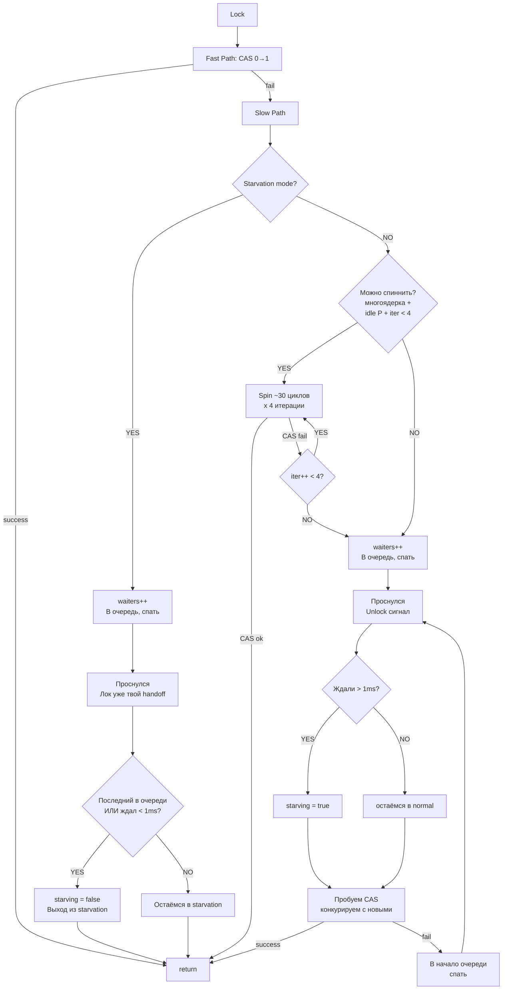

## Описание алгоритма

**Fast path:** одна атомарная операция CAS 0→1. Если мьютекс свободен — захватываем мгновенно, без slow path. ^lock-fast-path

**Slow path, Normal mode, условия для спиннинга:** многоядерность + есть idle P + меньше 4 итераций пройдено. Каждая итерация — ~30 циклов процессора. Максимум 4 итерации (120 циклов суммарно). ^lock-spin-conditions

Если спиннинг не помог — `waiters++` и горутина засыпает через `runtime_SemacquireMutex`. ^lock-sleep

**Slow path, Starvation mode:** спиннинг пропускается сразу, горутина идёт в очередь — handoff. После пробуждения лок уже у неё, конкуренции нет. ^lock-starvation-path

**После пробуждения в Normal mode:** если горутина ждала > 1ms — устанавливает флаг `starving`, конкурирует за CAS. При проигрыше встаёт в **начало** очереди (не в конец). ^lock-wakeup-normal

**Выход из Starvation mode (после получения лока через handoff):** если горутина последняя в очереди ИЛИ ждала < 1ms — сбрасывает флаг `starving`. ^lock-starvation-exit
