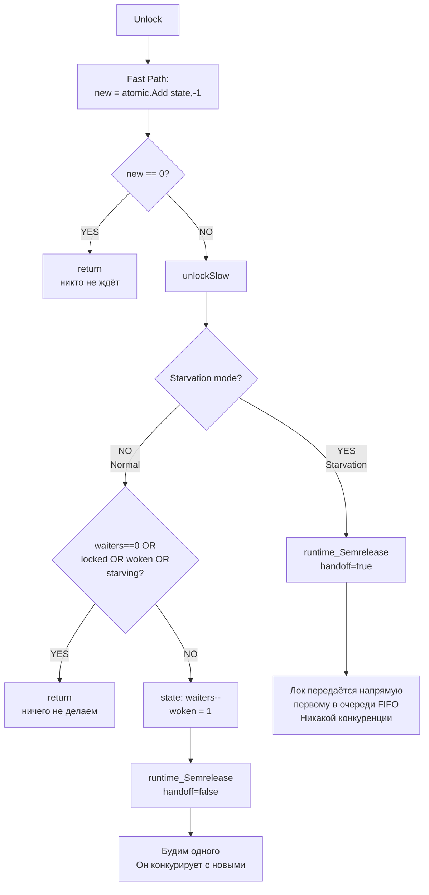

## Описание алгоритма

**Fast path:** `atomic.Add(state, -mutexLocked)`. Если результат == 0 — нет ожидающих, выходим. ^unlock-fast-path

**unlockSlow, Normal mode:** проверяем нужно ли будить кого-то. Условия при которых ничего не делаем: нет ожидающих (waiters==0), или лок уже снова захвачен (locked), или уже есть разбуженный (woken), или режим starving. ^unlock-slow-normal-skip

Если нужно будить: `waiters--`, устанавливаем `woken=1`, вызываем `runtime_Semrelease(handoff=false)` — горутина проснётся и будет **конкурировать** с новыми горутинами. ^unlock-slow-normal-wake

**unlockSlow, Starvation mode:** `runtime_Semrelease(handoff=true)` — лок передаётся **напрямую** первому в очереди FIFO, без конкуренции. ^unlock-starvation-handoff
